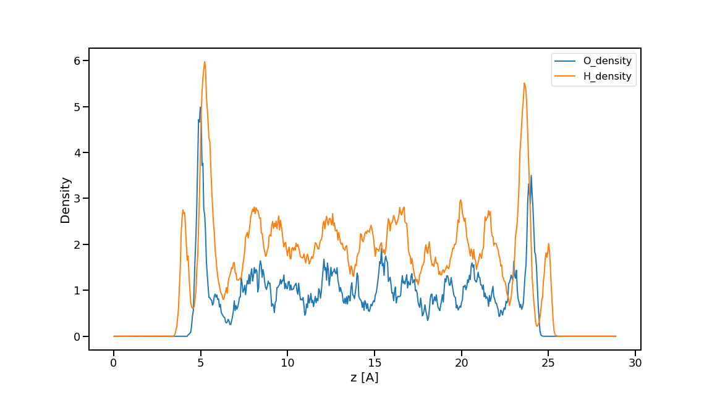

# Introduction

A toolbox collect some postprocessing workflow

## quick water density
```python
from toolkit.analysis.atom_density import AtomDensity
inp_dict={
     "xyz_file": "./Hematite-pos-1.xyz",
     "cell": [10.0564, 8.7091, 38.506],
     "surf2": [32, 33, 34, 35, 36, 37, 38, 39, 40, 41, 42, 43],
     "surf1": [112, 113, 114, 115, 116, 117, 118, 119, 120, 121, 122, 12],
     "density_type":[
         {
             "element": "O",
             "idx_method": "manual",
             "idx_list": O_idx,
             "density_unit": "water",
             "dz": 0.05,
             "name": "O_density"
             },
         {
             "element": "H",
             "idx_method": "manual",
             "idx_list": H_idx,
             "density_unit": "water",
             "dz": 0.05,
             "name": "H_density"
             } 
         ]
 } 
ad = AtomDensity(inp_dict)
ad.run()

# detail information is accessible in 
ad.atom_density
# ad.atom_density is dictionary with "name" as key.
# each key contain list type value, where the first element is z, second element is corresponding density.
ad.atom_density ==
{
    "O_density": "o_density"
    "H_density": "h_density"
}
ad.atom_density_z ==
{
    "O_density": "o_density_z"
    "H_density": "h_density_z"
}

# get average denstiy from center
width_list = [5, 6, 7, 8, 9, 10]
all_cent_density = ad.get_ave_density(width_list)

# quick plot for denstiy 
# if you want to symmetrize the density profile, set sym=True
ad.plot_density(self, sym=False)

```

## quick band alignment 
```python
from toolkit.analysis.band_align import BandAlign
inp = {
     "input_type": "cube", 
     "ave_param":{
         "prefix": "./00.interface/hartree/Hematite-v_hartree-1_", 
         "index": (1, 502), 
         "l1": 4.8, 
         "l2": 4.8, 
         "ncov": 2, 
         "save": True,  
         "save_path":"00.interface"
     },
     "shift_param":{
         "surf1_idx": [124, 125, 126, 127, 128, 129, 130, 131],
         "surf2_idx": [24, 25, 26, 27, 28, 29, 30, 31]
     },
     "water_width_list": [8, 9, 9.5, 10, 10.5, 11, 12, 13],
     "solid_width_list": [1, 2, 3, 4]

}
ba = BandAlign(inp)
#quick view of hartree fluctuation
fig = ba.plot_hartree_per_width('water')
fig = ba.plot_hartree_per_width('solid')

# detail information is accessible in 
ba.water_hartree_list
ba.solid_hartree_list
```