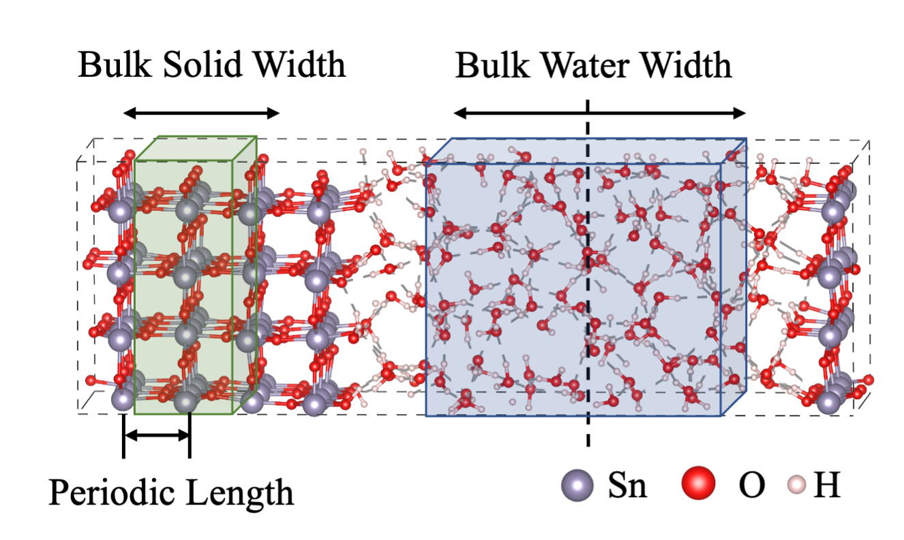

# Introduction

A toolbox collect some postprocessing workflow

# Atom Density Analysis
```python
from toolkit.analysis.atom_density import AtomDensity

# from 
inp_dict={
     "xyz_file": "./Hematite-pos-1.xyz",
     "cell": [10.0564, 8.7091, 38.506],
     "surf2": [32, 33, 34, 35, 36, 37, 38, 39, 40, 41, 42, 43],
     "surf1": [112, 113, 114, 115, 116, 117, 118, 119, 120, 121, 122, 12],
     "density_type":[
         {
             "element": "O",
             "idx_method": "manual",
             "idx_list": O_idx,
             "density_unit": "water",
             "dz": 0.05,
             "name": "O_density"
             },
         {
             "element": "H",
             "idx_method": "manual",
             "idx_list": H_idx,
             "density_unit": "water",
             "dz": 0.05,
             "name": "H_density"
             }
         ]
 } 
ad = AtomDensity(inp_dict)
ad.run()

# detail information is accessible in 
ad.atom_density
ad.atom_density_z

# get average denstiy from center
width_list = [5, 6, 7, 8, 9, 10]
all_cent_density = ad.get_ave_density(width_list)

# quick plot for denstiy 
# if you want to symmetrize the density profile, set sym=True
ad.plot_density(self, sym=False)

```

# Band Alignment 
## Quick Start
```python
from toolkit.analysis.band_align import BandAlign
inp = {
     "input_type": "cube", 
     "ave_param":{
         "prefix": "./00.interface/hartree/Hematite-v_hartree-1_", 
         "index": (1, 502), 
         "l1": 4.8, 
         "l2": 4.8, 
         "ncov": 2, 
         "save": True,  
         "save_path":"00.interface"
     },
     "shift_param":{
         "surf1_idx": [124, 125, 126, 127, 128, 129, 130, 131],
         "surf2_idx": [24, 25, 26, 27, 28, 29, 30, 31]
     },
     "water_width_list": [8, 9, 9.5, 10, 10.5, 11, 12, 13],
     "solid_width_list": [1, 2, 3, 4]

}
ba = BandAlign(inp)
#quick view of hartree fluctuation
fig = ba.plot_hartree_per_width('water')
fig = ba.plot_hartree_per_width('solid')

# detail information is accessible in 
ba.water_hartree_list
ba.solid_hartree_list
```
## Prepare Input Data
One has to collect all hartree cube files from continuous MD simulations in one directory with same prefix and suffix of `.cube`.
For example, in directory `./00.interface/hartree/`, one should prepare cube file named `Hematite-v_hartree-1_1.cube`, `Hematite-v_hartree-1_2.cube`, ..., `Hematite-v_hartree-1_501.cube`.

## Explanation for Parameters

- `input_type`: `cube` for cp2k cube files
- `prefix`: define prefix for cube files
- `index`: define the index for cube files, see `Prepare Input Data`
- `l1`: parameter for nanosmoothing. `l1` equals to natural number (`n`) times periodic length (`pl`) for oxides slab. For example, the z position of a layer for $\mathrm{SnO_2}$(110) slab is defined as the ensemble-averaged z positions of $\mathrm{Sn}$ atoms in the layer. Then, the periodic length is inter-layer distance between two layers. Assuming `pl` is 2.4 $\mathrm{\AA}$, `l1` can be 2.4, 4.8, and 7.2 $\mathrm{\AA}$.
- `l2`: parameter for nanosmoothing. `l2` equals to natural number (`n`) times periodic length (`pl`) for water. Since water dose not have periodicity, we recommend to set `l2` same as `l1`.
- `ncov`: parameter for nanosmoothing. `ncov` is number of convolution. `ncov` equals to 2 for interfaces and equals to 1 for surface (slab-vacuum). When `ncov` is 1, `l2` won't be used.
- `save`: whether to save post processed hartree data. We recommend to set it as `True`.
- `save_path`: save_path for post processed hartree data.
- `surf1_idx`: `place holder`
- `surf2_idx`: `place holder`
- `water_width_list`: Width for bulk water. Bulk Water Width is plotted in above figure. Since one has to test multiple width value, the width is input as a list.
-  `solid_width_list`: Width for Bulk Solid. Bulk Solid Width is plotted in above figure. Since one has to test multiple width value, the width is input as a list.
